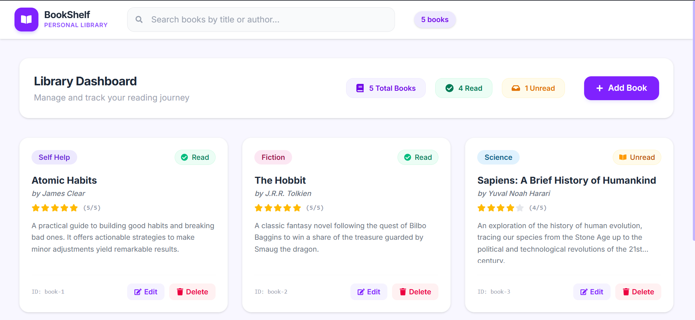
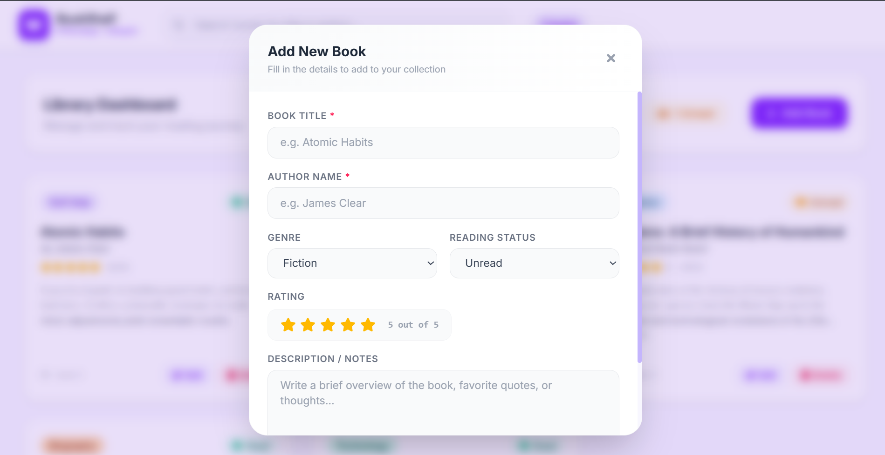
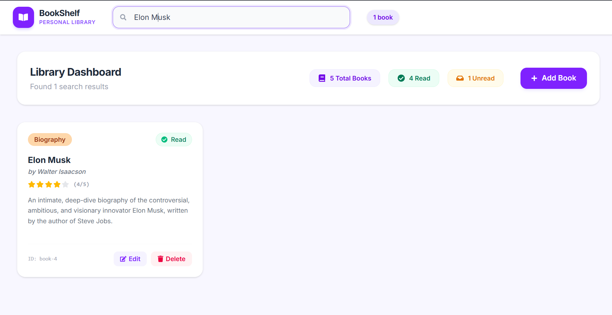

#  BookShelf - Personal Library

A modern, responsive, and sleek full-stack web application designed to help book lovers manage, filter, and track their reading collections. It provides real-time search, interactive ratings, reading statistics, and database persistence using MongoDB.

## Preview

### Main Dashboard


### Add / Edit Book Modal


### Real-Time Search & Filtering


---

##  Project Structure

This project uses a monorepo structure separating the frontend application and backend server:

```
book-cards/ (Root)
├── README.md              # Project documentation and guide
├── LICENSE                # License information
├── .gitignore             # Root Git ignore rules
├── frontend/              # React.js + Tailwind CSS Frontend Client
│   ├── src/
│   ├── index.html
│   ├── package.json
│   └── vite.config.js
└── server/                # Node.js + Express + MongoDB Backend API
    ├── config/            # Database configuration (db.js)
    ├── controllers/       # Route controllers (bookController.js)
    ├── models/            # MongoDB schema models (Book.js)
    ├── routes/            # REST API router endpoints (bookRoutes.js)
    ├── server.js          # Express app entry point
    └── package.json       # Backend dependencies & scripts
```

---

##  Features

- **Library Dashboard:** Instantly view statistics of your library, including total books, books read, and books unread.
- **Real-Time Search & Filtering:** Filter your library instantly by book title or author.
- **Add & Edit Books:** Add new books or edit existing details (title, author, genre, rating, status, notes/description) via an elegant modal form.
- **Custom Categories / Genres:** Select predefined genres (Self Help, Fiction, Science, Biography, Technology) or specify custom ones.
- **Interactive Rating System:** Rate books from 1 to 5 stars using an interactive UI.
- **MongoDB Database Sync:** Your library collection is stored in MongoDB, ensuring persistence across all sessions and devices.
- **Error Handling & Loading States:** Graceful loading spinners and rose-colored warning cards help recover from server-connection drops.
- **Premium Modern Design:** Sleek typography (Inter), responsive grid layouts, custom pastel tags, and subtle hover animations.

---

##  Tech Stack

### Frontend
- **Framework:** React 19
- **Build Tool:** Vite 8
- **Styles:** Tailwind CSS v4
- **Icons:** React Icons (FontAwesome)

### Backend
- **Server:** Node.js + Express.js
- **Database:** MongoDB + Mongoose (ODM)
- **Hot-Reload:** Nodemon

---

##  Getting Started

### Prerequisites
Make sure you have [Node.js](https://nodejs.org/) installed (version 18+ recommended) and a running instance of **MongoDB** (local service or MongoDB Atlas cluster).

### Installation & Setup

1. **Clone the Repository** and open a terminal in the project root.

2. **Set up the Backend Server**:
   ```bash
   cd server
   npm install
   ```
   Create a `.env` file inside the `server/` directory and add your connection variables:
   ```env
   PORT = 5000
   MONGO_URI = mongodb://127.0.0.1:27017/book_library
   ```
   *(Replace `MONGO_URI` with your MongoDB Atlas link if you are connecting to a cloud cluster).*

3. **Set up the Frontend Client**:
   ```bash
   cd ../frontend
   npm install
   ```

---

##  Running the Application

To run the full-stack application locally, you will need to start both the server and client.

### Step 1: Start the Backend Server
From the `server/` directory, run:
```bash
npm run dev
```
The server will start at [http://localhost:5000](http://localhost:5000) and establish a Mongoose connection to MongoDB.

### Step 2: Start the Frontend Client
From the `frontend/` directory, run:
```bash
npm run dev
```
Vite will host the local development server at [http://localhost:5173](http://localhost:5173). Open this link in your browser to interact with the application.

---

##  API Endpoints

The backend routes are mounted under `/api/books` and perform RESTful operations:

| Method | Endpoint | Description | Validation Rules |
| :--- | :--- | :--- | :--- |
| **GET** | `/api/books` | Retrieve all books (or search via `?search=query`) | Case-insensitive regex matching Title & Author |
| **POST** | `/api/books` | Add a new book to the library | Requires Title, Author, Genre, Status, and Rating |
| **PUT** | `/api/books/:id` | Update an existing book's details by ID | Updates individual fields; validates inputs |
| **DELETE** | `/api/books/:id` | Remove a book from the library by ID | Removes record from MongoDB |

---

##  Validation Rules

The backend server strictly enforces these rules on input payloads, returning descriptive HTTP 400 Bad Request error lists for invalid fields:
1. **Title**: Required (cannot be empty or whitespace).
2. **Author**: Required.
3. **Genre**: Required.
4. **Rating**: Required, must be a number between **1** and **5** (inclusive).
5. **Status**: Required, must only accept **Read** or **Unread**.

---

##  License

This project is open-source and available under the [MIT License](LICENSE).
